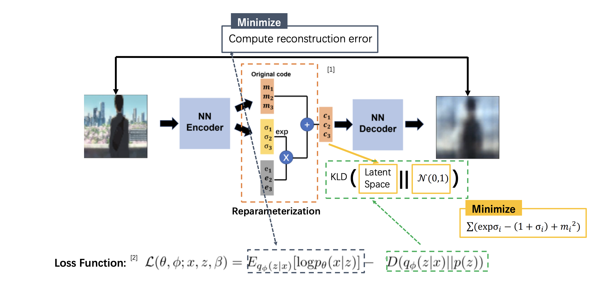
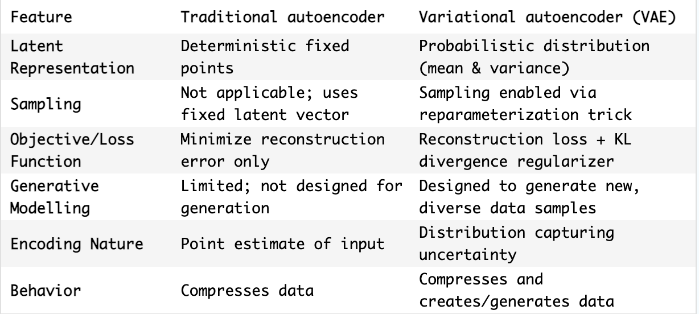
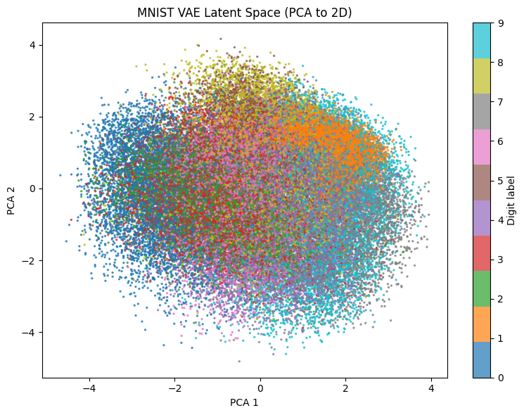
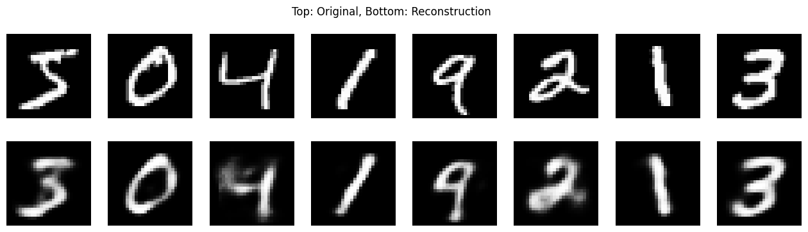

VAE is the generative modelling architecture that overcome the limitations of the vanilla autoencoders

[img from these slides](https://deeplearning.cs.cmu.edu/F21/document/recitation/Recitation11/AE_and_VAE.pdf)
> instead of encoding input data to a single latent vector, VAEs encode each input into a distribution—typically a Gaussian, the latent space is assumed to follow a normal distribution, which allows us to sample from it and generate new, meaningful data via the decoder.

the encoder learns to approximate the mean and variance of this Gaussian distribution. However, since sampling from this distribution is not differentiable, VAEs use the reparameterization trick to enable backpropagation

**more explainations**:
- the latent variable $z$ follows a **prior** distribution:

  $$p(z) = \mathcal{N}(0, I)$$

- the encoder learns an **approximate posterior**:

  $$q_\phi(z \mid x) = \mathcal{N}(\mu(x), \sigma^2(x) I)$$

where:
- $\mu(x)$ is the mean vector output by the encoder.
- $\sigma(x)$ is the standard deviation vector.

**reparameterization trick**:

sampling from $q_\phi(z \mid x)$ directly:

  $$z \sim \mathcal{N}(\mu(x), \sigma^2(x) I)$$

is non-differentiable. So, we use the **reparameterization trick**:

  $$z = \mu(x) + \sigma(x) \odot \epsilon, \quad \text{where } \epsilon \sim \mathcal{N}(0, I)$$

this makes $z$ a deterministic function of $\mu$, $\sigma$, and a noise variable $\epsilon$, enabling gradient backpropagation.

**vae loss**: 
1. **reconstruction Loss** (e.g., mean squared error or cross-Entropy):

   $$E_{q_\phi(z \mid x)} [ \log p_\theta(x \mid z) ]$$

2. **KL divergence** between the approximate posterior and the prior:

   $$D_{\text{KL}} \left[ q_\phi(z \mid x) \parallel p(z) \right]$$

3. **total loss** (Evidence Lower Bound, ELBO):

  $$L(x) = -E_{q_\phi(z \mid x)} [ \log p_\theta(x \mid z) ] + D_{\text{KL}} \left[ q_\phi(z \mid x) \parallel p(z) \right]$$

**after training**:
after training:
- sample $z \sim \mathcal{N}(0, I)$
- generate new data: $x' = \text{Decoder}(z)$

**difference between AE and VAE**: 
- difference in latent spaces  
  

- difference

### AFTER TRAINING 

**look after training the latent space coverted itself into a normal distribution** 

**reconstruction images**

